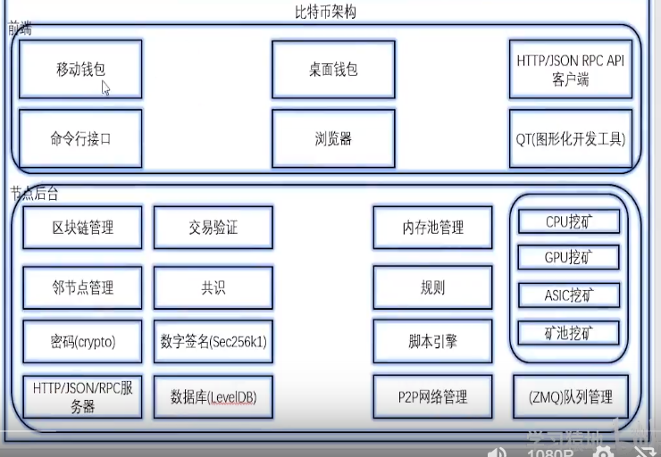
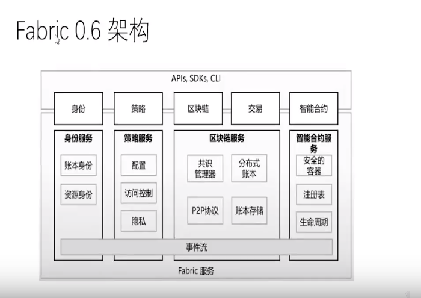
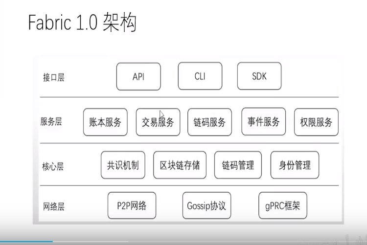
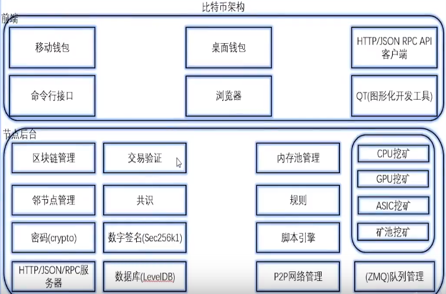
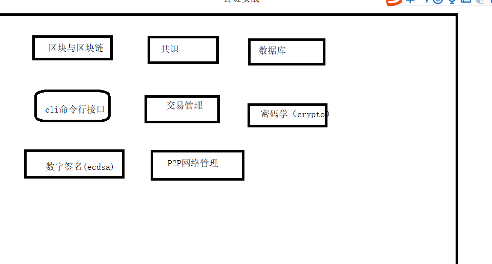
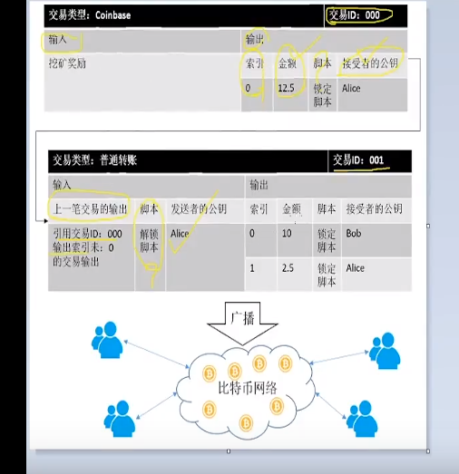
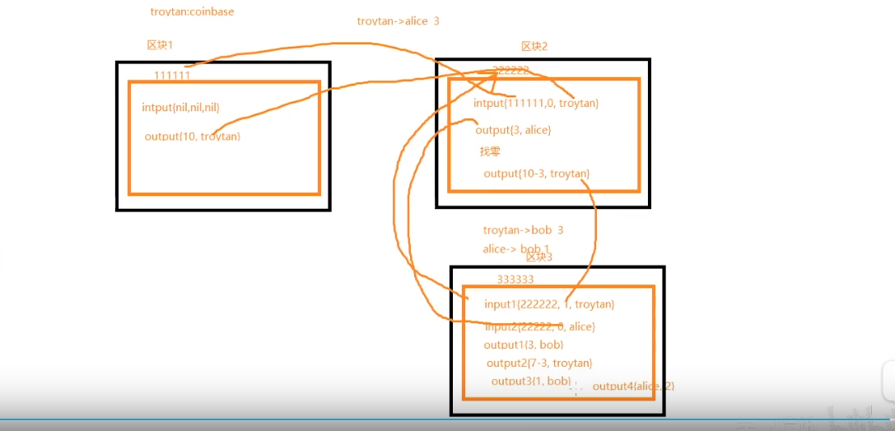
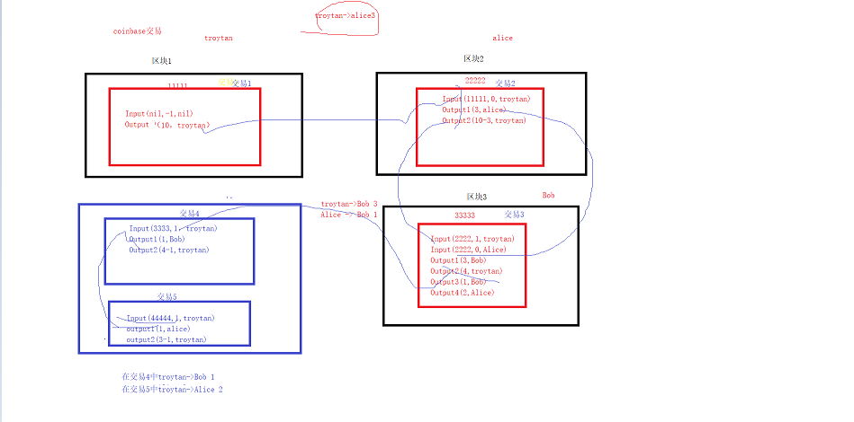
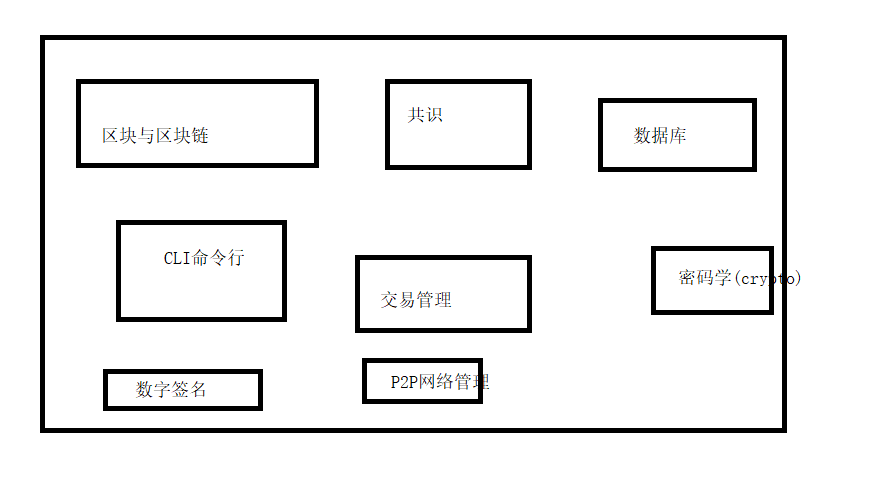

区块链产生

github代码地址：https://github.com/themoonstone?tab=repositories

1. 密码朋克
   
   1. 通过匿名性保护隐私安全  
2. 不可篡改文件记录
   
   1. 加盖时间戳到文件内容 证实数据存在，保证安全、
3. 数字货币

2. 发展史: 前面三个是公链  最后一个是联盟链

   1. 09年比特币诞生1.0
   2. 14年的时候以太坊诞生2.0
   3. 18年中期的时候，EOS诞生 3.0
   4. Fabric（联盟链）

5. 区块链的场景概念

   1. 数字货币

      1. 可以与现金进行等价交换， 拥有现金流的属性和功能
      2. 虚拟货币的区别： 通过购买力购买游戏币 但是只能在对应的官方平台但是数字货币可以在任何平台进行等价交换

   2. ICO

      1. 众筹

   3. 电子钱包

      1. 在电商中经常使用到的支付工具

   4. 什么是区块链（定义）

      1. 区块链是一种集成的应用模型 这是4个技术
         1. 点对点传输协议
         2. 现代密码学
         3. 共识算法
         4. 分布式数据存储

   5. 区块链特点

      1. 可追溯（时间戳）

      2. 不可篡改（时间戳）

      3. 去中心化（部分去中心化代替全部的中心化）

      4. 完整备份

         1. 区块链具有完整分布式存储的特性

      5. 历史记录

         1. 被存储的数据拥有完整的历史记录  可以快速查看复原

      6. 交易广播：一次交易分发给其他的节点同步进行接收

         算法是非常重要的东西，能不能深刻理解并且使用算法

   6. 区块链加密货币的特点

      1. 独立性： 所有货币都是独立存在的
      2. 唯一性： 地址， 交易都具有不可重复的唯一性
      3. 匿名性： 绑劫案 要求比特币支付 不要用现金转账的方式进行z账户信息和客户信息是没有关联的，整个交易过程全局加密
      4. 不可伪造：可以查找区块链的每一条的交易信息

   7. 区块链的核心

      1. 点对点传输协议： 在网络中的数据流通的方式
      2. 现代密码学： 在区块链中的应用中：公私钥签名，哈希算法
      3. 共识算法： 所有的共识算法最终都是为了打成数据的一致性
      4. 分布式数据存储： python  H5 但是go语言不是初级开发工程师，这个时候出现了并发量的问题 没有其他的开发经验 分布式mapreduce 但是应用都会应用到go语言的上面， 很多公司都要求有分布式存储的经验，分布式的存储防止我们有中心化的节点 

   8. 区块链概念

      1. 区块链

         1. 本质一个分布式的账本，通过各种共识算法决定谁能抢到最终的记账权,区块为单位，区块产生的时间顺序来进行连接

      2. 区块

         1. 概念： 区块链基本组成单位
         2. 区块头
            1. 时间戳
            2. 当前区块哈希
            3. 父区块哈希
            4. 随机数（在做工作量证明的时候的Nonce 难度）
            5. Merkle树
            6. 区块号码
         3. 区块体：交易数据 etherscan.io
         
         
         
         
      
      3. bitcore比特币的节点组成一个分布式网络
      
         1. 全块链的区块数据都存储在一个节点中， 所有的节点组成一个分布式数据库，任何一个或者多个节点退出，都不会影响其他节点，因为每个节点都保存了所有的数据
      
      4. 节点  数据同步下来之后你的电脑就成了一个节点
      
         1. 可以理解成一个运行区块链软件的计算机
         2. 分类
            1. 全节点： 保存了完整的副本，安全性极高，效率不高
            2. 轻节点：不保存所有区块，需要依赖全节点进行验证，效率更高，安全性不如全节点
            3. 挖矿节点： 带有挖矿功能 全节点+ 挖矿（专门处理交易的验证）
      
      5. 挖矿
      
         1. 对交易进行验证处理（记账），区块就是挖矿的时候产生的
         2. 穷举随机数算法（ 上一个区块的哈希值+10分钟之内产生所有的交易 +随机数），生成哈希，与目标哈希比较，成功说明挖矿成功
      
      6. 分叉
      
         1. 原因
            1. 比特币的发展
            2. 比特大陆 未来发展趋势 一个是
            3. 以太坊  但是在以太坊上可以自行的开发DApp 
            4. 17年的时候 被黑了  要不要将智能合约换下来  ETC ETH
         2. 分类
            1. 升级分叉
               1. 旷工遵从不同的规则导致的分叉
               2. 硬分叉 王者荣耀的更新 如果区块共识规则改变之后，不允许向前没有办法认可从新节点产生的区块
               3. 软分叉 微信的更新 如果共识规则改变之后，允许向前兼容，旧节点可以兼容新的节点产生的区块
            2. 挖矿分叉
               1. 现象：两个或者多个旷工同时完成了工作量证明，就会产生两个新的区块，形成分叉
               2. 不同的旷工跟随了不同的区块但是不同的链上算力会有区别旷工的数量不一样， 导致链的增脏速度不一样 最终会出现一条链更长这条链就会成为主链.
      
      7. 51%的攻击 只有算力超过整条链的51% 增长链最终只能  设计之初就能够修改共识规则了 程序限制一旦达到51%的算力之后成本大大的炒作了利益  要不然就成了一条私链了
      
      8. 交易
      
         1. 概念： 一笔资产在交易者之间的转移
         2. 内容：
            1. 金额
            2. 发送者
            3. 接收者
            4. 交易ID(HASH)
      
      9. 双花
      
         1. 概念：复用数字货币的数字特性，可以完成两次或者多次的支付
            1. 我给你转了10块钱 传统货币天然存在的唯一性
            2. 现金流  第三方   支付宝1万     花了10块钱 
            3. 传统的虚拟货币之所以避免爽滑，有可依赖的第三方机构提供保证
            4. 区块链需要达成只通过分布式节点之间的相互校验有共识机制来避免双花，同时完成价值的转换
      
         
      
      10. UTXO(Unspent Transaction Output)交易模式 
      
          1. 比特币有的交易方式，比特币交易过程中的基本单位，主要是为了避免双花
      
      11. 哈希
      
          1. 将任意的原始数据（交易记录通过指定的哈希函数编码为指定长度的字符串）
          2. 在区块链中的使用，生成地址交易验证
          3. 特点
             1. 不可逆
             2. 随机性
             3. 时间的正相关：输入的源数据越长，哈希处理时间就更长
      
      12. 加密算法
      
          1. 对称加密
             1. 加密与解密都使用相同的密钥
          2. 非对称加密
             1. 采用公钥和私钥进行加密
             2. 无法用公钥反推私钥
      
      13. 数字签名、
      
      14. Merkle树
      
          1. Merkle树可以是二叉树也可以是多叉树具有树的所有的特点
          2. 在区块链中的作用： 快速校验 归纳交易数据的完整性
          3. 在区块链中Merckle树可以极大的提高查询效率，区块头只需要保存一个Merkle树的哈希值
          4. Merkle支持SPV Simple Payment Validation 
      
      15. P2P
      
          1. 通过对等网络来分配工作任务的分布式应用架构（
          2. 迅雷采用的就是P2P
          3. 由于在P2P所有网络的节点是对等的，不存在任何一个中心化节点也不存在所需的层级结构，所以每个节点都需要承担验证区块的功能
      
   9. 区块链分类

      1. 公有链：整整意义上的分布式区块链，任何一个节点都可以退出/加入网络中
      2. 私有链：部分中心化的区块链 房产中介  房屋信息的完全去中心化的区块链不需要中介 信息的不对等 房东1200 组1500  中介300  区块链租房省钱 美国的一个州实现的区块链的结盟 具有一定的分布式特点但是有一个中心节点可以指定参与者，在公司的内部，有些数据是不能泄露的， 不可篡改的特性形成的私链  财务 金融
      3. 联盟链 部分的去中心化的区块链 拥有权限控制的功能，
         1. 代表是Fabric
         2. 国内的是京东的一个 中国的区块链优先加入一个接口 监管的接口 

   10. 区块链架构特点

       1. 去中心化基于分布式系统 整个网络中没有中心节点存在
       2. 可靠数据库： 分布式存储  数据库多 参与系统的节点越多 数据的安全性就越高
       3. 开源可编程：  区块链提供了灵活的脚本系统至于完善的开发平台， 支持用户创建更加高级的应用
       4. 集体维护：区块链中的数据由整个系统所有具备记账功能的节点维护
       5. 安全可信： 通过现代密码学实现
       6. 准匿名性： 采用与身份信息无关的哈希作为交易地址与交易ID

   11. 典型应用分析

       1. 比特币
          1. 总数2100万不增发 
          2. 奖励机制： 逐年减半 ， 开始奖励50个现在12.5个

       2. 架构
          
       1. 
          
       1. 前端

          1. 钱包： 保存用户私钥 管理用户余额  提供比特币交易 支付转账等功能
          2. 钱包分类
             1. 决定性钱包：所有的额私钥都由一个私钥种子通过单向哈希算法生成
                1. 普通决定性钱包： 由私钥种子生成所有私钥
                2. 层级决定性钱包：由私钥种子生成父私钥， 父私钥生成子私钥
             2. 非决定性钱包
                1. 直接保存私钥 私钥直接存放在DB上面 最容易理解
             3. 展示方式的分类
                1. 桌面钱包
                   1. 厚钱包：下载整条区块链可以完整交易安全性高，验证成本高
                   2. 薄钱包： 不会下载整条区块链采用部分存储 +  节点请求验证的方式 
                   3. 离线钱包： USB介质最为安全的，纸钱包 可以有效防范网络攻击
          3. HTTP/JSON RPC API
             1. 比特币提供的接口可以使外部通过该接口直接访问或者控制比特币节点
             2. 通过命令行实现类似于钱包

          4.浏览器

          1. 访问区块链数据等信息

       2. 节点后台： 负责比特币的网络的通信 区块链的维护

          1. 基本概念： 由哈希生成
             1. 地址的生成的过程 hash字符串不是随便的数不是这么加单私钥 公钥以及他们如何转换成地址
          2. 生成过程
             1. 随机数生成私钥
             2. 采用Secp256k1 椭圆加密算法生成公钥
          3. 生成地址
             1. 以公钥作为输入进行SHA256 再进行RIPEMD10 最后通过base58编码生成比特币地址
          4. 比特币区块校验： 确保 确实完成了工作量证明
             1. 校验内容： 格式 、难度、 时间戳、 交易
          5. 比特币交易
             1. 交易结构
                1. 输入（Input）
                2. 输出（output）
                3. 交易的ID（HASH）
             2. 说明
                1. 每一笔交易来自之前面交易的输出
             3. UTXO数据库：专门用于存储当前比特中未被花费的输出

   2. 以太坊
      1. 以太坊的基本概念：一个平台 一个用于开发去中心化DAPP的平台
      2. 智能合约： 一个拥有自我校验与自我执行
      3. 以太坊为什么可以成为区块链2.0 以太坊提供了非常方便的应用开发平台 让开发者只需要关注上层应用
      4. 共识：POW （ETHash）

   3. EOS

      1. EOS的基本概念： 一个用于开发去中心化DAPP的分布式平台
      2. 与以太坊的比较
         1. TPS有了极大的提高 号称能够达到百万的TPS处理量
         2. 以太坊本身是一条公链 一条河，其中每一个DAPP访问整条链上的资源
         3. EOS本身不在是一条单链的公链它是一个区块链的基本架构，开发的可以自由的zai EOS上创建公链 链与链之间不会影响彼此的资源的使用 因此不会出现单个应用占用资源过多使得整个网络的拥堵
      3. 共识算法： DPOS  
      4. EOS上的智能合约调用不需要手续费（根据当时场景做分发）

   4. Fabric（联盟链）

      1. 联盟链的代表，与公链的最大的区别在于不发行虚拟货币
      2. 目标： 实现一个通过权限管理区块链的底层基础框架

      

      

      3. R3联盟  打造适合任何的企业需求的基础框架

      

3. 架构分类：
   1. 身份服务
      1. Fabric具有身份识别能力，加入退出Fabric需要权限
   2. 策略服务
      1. 提供访问控制授权等一系列的功能
   3. 区块链服务
      1. 提供构建分布式账本的基础能力以及数据传输共识达成的底层的功能
   4. 智能合约： 验证节点上运行的分布式程序  用于自动执行特定的业务规则

   

golang简单公链实战（仿比特币）

1. 项目愿景： 通过该项目能够了解区块链的构成以及如何实现一个功能完善的区块链
2. 项目架构
3. 项目特点
4. 项目设计（文档  数据库）
5. 编码

东西简单化‘

必须要有的东西保存下来

3. 项目特点
   1. 去中心化
   2. 可追溯
   3. 不可篡改
4.  项目设计

3. 流程
   1. 区块与区块链
   2. 实现Pow共识算法
   3. 实现数据库的持久化

区块链的核心部分

# 比特币交易原理

1. 传统的web交易

2. 基本概念

   1. 比特币系统中的交易没有余额的概念，使用的是UTXO模型，在创痛的交易过程中的交易月实际上一个比特币钱包地址的一个UTXO的集合

3. 交易组成

   1. 在比特币中交易主要由输入 输出 ID(txHash)交易的时间

4. UTXO交易模型

   1. 比特币专有的交易模型
   2. 在比特币中交易实际上就是不断查找指定钱包地址的UTXO集合，然后进行修改的过程
   3. utxo是比特币交易中最基本不可拆分的，把UTXO理解成一个币 该币是一个拥有一定金额一个拥有者。

5. 交易过程

   1. 思考如何保证用户只使用术语自己的比特币

   2. 如何保证一笔交易是有效的

   3. 流程图

      

3. 交易分类
   1. coinbase：挖矿的奖励的比特币 由系统提供 不包含input
   2. 普通转账 正常的转账交易有发送者参与，所以包含input

UTXO的核心原理

都是围绕着交易状态的改变

去中心化的区块链

对交易做优化和处理

现在我们尝试处理多笔交易

复习：

密码学回顾：

1. 在区块链中的用途
   1. 地址生成
   2. 交易签名
2. base64编码
   1. 在线加密解密工具 https://tool.oschina.net/encrypt?type=3
   2. 基本概念： 用一种由64个字符表示二进制数据的方法
   3. 作用： 通常用于在HTTP中传递比较长的信息的处理方法
   4. 编码原理：
      1. 在给顶的字符创进行整合 由3个8位转换为4个六位 在6位前面补0 对于要编码的数据由字符串转换为二进制数据， 如果不是3的倍数最后的余数只会是1或者2，base64在末尾用\x00补充 在编码展示的末尾 添加一个或者两个"=" 一个“=”代表不足的字节数，在解码的时候自动将等号去掉
   5. 编码实例： 将字符串"Main"进行base64的编码
      1. 查找字符串中每个字符对应的ASCII编码
         1. M 77
         2. a 97
         3. n 110
      2. 将ascii码转换为二进制数据
         1. M: 64+8+4+1=01001101
         2. a:  64+32+1 01100001
         3. n: 64 + 32 + 8 + 4 + 2 = 01101110
      3. 重组为4个6bits的字节组
         1. 001010011
         2. 00010110
         3. 00000101
         4. 00101110
      4. 再转换为10进制
         1. 16+2+1 = 19
         2. 16+4+2=22
         3. 1+4=5
         4. 2+4+8+32=46
      5. 通过base64编码对照表查找对应的字母，得到base64的编码结果
         1.  TWFu
3. base58编码
   1. 为什么需要base68编码与base64的区别
      1. 在base64的基础上去掉了6个字符
         1. 去掉数字"0" 大写字母"O" 大写字母"I", 小写字母"l"
         2. 0x+++++///// 不是说不可以 作为账号难以接受  去掉了字符"+""\"作为非字母或者数字 当成一个账号难以接受
      2. 实现go语言的base58的编码
         1. 确定base58编码的基数表
         2. 将传入的字符串转换为字节数组、
         3. 将字节数组转换为big.Int
         4. 对基数58求余 直到余数为0作为索引在基数表中对应的字符串联起来

